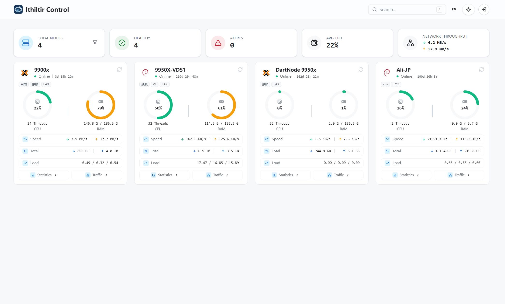

# Ithiltir Dash [](https://github.com/Ithildur/Ithiltir/releases) [](https://github.com/Ithildur/Ithiltir/releases) [](LICENSE)

Ithiltir Dash is a single-instance, self-hosted server monitoring dashboard. One Dash process serves the web UI, HTTP API, theme assets, install scripts, and node binary download paths.

**Resources:** [中文](README_CN.md) · [Documentation](https://www.ithiltir.dev/) · [Architecture](docs/architecture.md) · [API](docs/api.md) · [Node agent](https://github.com/Ithildur/Ithiltir-node)

## Screenshot



## Scope

- Live node dashboard, online-rate data, and metrics history
- Node search, group filters, and guest visibility controls
- PVE / Proxmox VE host support
- RAID checks and failure alerts
- SMART status, critical warnings, SMART temperature, and thermal sensor runtime fields
- Traffic statistics, monthly cycles, and 95th percentile billing data
- Node, group, alert, theme, and system settings management
- Agent metrics, static host data, and bundled update manifests
- Built-in Linux, macOS, and Windows agent install scripts
- One process for the SPA, API, admin console, and deployment assets

## Requirements

- PostgreSQL 16+ with TimescaleDB
- Redis; local or small single-instance deployments can start with `--no-redis`, which keeps sessions, hot snapshots, and alert runtime state in process memory and loses them on restart
- Go 1.26+ to run from source or build packages
- Bun 1.3.11 to build the frontend

## Quick Start

1. Copy `configs/config.example.yaml` to `config.local.yaml`.
2. Replace every `__...__` placeholder in `config.local.yaml`.
3. Set the admin password in `monitor_dash_pwd`.
4. Run database migrations.
5. Start the server.

```bash
cp configs/config.example.yaml config.local.yaml
export monitor_dash_pwd='<password>'
go run ./cmd/dash migrate -config config.local.yaml
go run ./cmd/dash -debug
```

When it starts, open `app.public_url` for the dashboard and `app.public_url + "/login"` for the admin console. `app.public_url` must be a root URL. Path prefixes such as `/dash` are not supported.

## Configuration

Minimum config fields:

- `app.listen`
- `app.public_url`
- `database.user`
- `database.name`
- `redis.addr`
- `auth.jwt_signing_key`

The admin login password is read only from the `monitor_dash_pwd` environment variable.

Config lookup order:

- `config.local.yaml`
- `config.yaml`
- `configs/config.local.yaml`
- `configs/config.yaml`
- `$DASH_HOME/configs/config.local.yaml`
- `$DASH_HOME/configs/config.yaml`

`database.retention_days` is optional and defaults to `45` days. The 5-minute traffic fact table uses independent `database.traffic_retention_days`; when omitted it uses `max(database.retention_days, 45)`. For 95th percentile billing history, set it to `90` or higher.

## Deployment Baseline

- Default deployment shape: `PostgreSQL 16+ + TimescaleDB + Redis`
- `install_dash_linux.sh` requires Redis `8.2.3+`; when the OS repository cannot provide it, the installer builds Redis from source and installs `redis-server.service`
- Recommended minimum: `1 vCPU / 2 GB RAM / 40 GB SSD/NVMe`
- Setups below `4 GB RAM` should enable `SWAP`
- Reverse proxies must preserve same-origin paths: proxy `/api`, `/theme`, and `/deploy` to Dash, and let Dash serve the SPA at `/`
- Do not point browser requests directly at a cross-origin backend unless CORS, cookie, and CSRF policies are designed together

## Development

Standalone frontend development:

```bash
cd web
FRONT_TEST_API=http://127.0.0.1:8080 bun run dev
```

`FRONT_TEST_API` points to a running Dash backend. The Vite dev server proxies only `/api` and `/theme`; frontend code still uses same-origin relative paths.

Common checks:

```bash
go test ./...
cd web && bun run lint
cd web && bun run typecheck
```

## Build And Package

Build the frontend:

```bash
bash scripts/build_frontend.sh -o build/frontend/dist
```

Build a Linux package:

```bash
bash scripts/package.sh --version 1.2.3-alpha.1 --node-version 1.2.3-alpha.1 -o release -t linux/amd64 --tar-gz
```

Dash server release packages currently target Linux amd64 and Linux arm64. macOS and Windows deploy assets are agent assets.

PowerShell:

```powershell
powershell -File scripts/build_frontend.ps1 -OutDir build/frontend/dist
powershell -File scripts/package.ps1 -Version 1.2.3-alpha.1 -NodeVersion 1.2.3-alpha.1 -OutDir release -Targets linux/amd64 -Zip
```

Node version source:

- Omit `--node-version` / `-NodeVersion`: use the latest compatible tag from `https://github.com/Ithildur/Ithiltir-node.git`. Prerelease Dash builds use the newer of the latest node prerelease and latest node release, and fall back to the latest node release when no node prerelease exists.
- Pass `--node-local` / `-NodeLocal`: read local binaries from `deploy/node`.

Update an installed Linux service:

```bash
bash update_dash_linux.sh --check
bash update_dash_linux.sh
bash update_dash_linux.sh --test
```

By default the updater installs the latest release. Pass `--test` to install the latest prerelease. If the installed Dash is a prerelease newer than the latest release, the default release update stops with a warning.

## Repository Layout

| Path | Contents |
| --- | --- |
| `cmd/dash` | server, migration, and theme packaging entry points |
| `internal` | backend application code |
| `web` | SPA source bundled into the app |
| `configs` | sample config |
| `db/migrations` | database schema changes |
| `scripts` | frontend build and release packaging entry points |
| `deploy/node` | local node binaries for offline packaging |

## License

AGPL-3.0-only. See [LICENSE](LICENSE).
