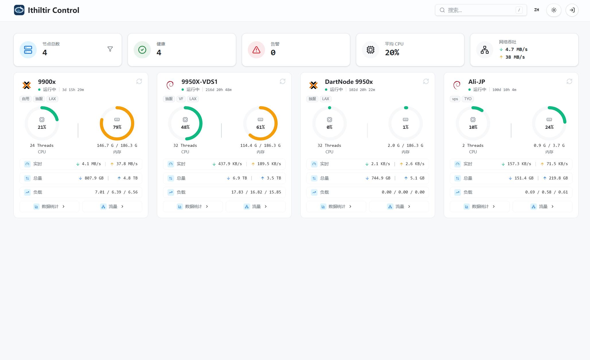

# Ithiltir Dash

Ithiltir Dash 是单实例、自托管的服务器监控面板。一个 Dash 进程同时提供 Web UI、HTTP API、主题资源、安装脚本和节点二进制分发入口。

English: [README.md](README.md)

文档：[架构](docs/architecture_CN.md) · [API](docs/api_CN.md)

## 界面预览



## 功能范围

- 实时节点看板、在线率和历史指标
- 节点搜索、分组过滤和游客可见范围控制
- PVE / Proxmox VE 宿主机适配
- RAID 状态嗅探和失效告警
- SMART 状态、NVMe critical warning、SMART 温度和普通温度传感器运行时字段
- 流量统计、月度周期和 95 计费数据
- 节点、分组、告警、主题和系统设置管理
- Agent 指标、静态信息和打包更新下发
- 内置 Linux / macOS / Windows Agent 安装脚本
- 单进程交付 SPA、API、管理台和部署资产

## 运行要求

- PostgreSQL 16+ 和 TimescaleDB
- Redis；本地或小型单实例可用 `--no-redis` 启动，此时会话、热点快照和告警运行时状态保存在进程内存中，重启后丢失
- 从源码运行或打包需要 Go 1.26+
- 构建前端需要 Bun 1.3.11

## 快速启动

1. 复制 `configs/config.example.yaml` 为 `config.local.yaml`。
2. 替换 `config.local.yaml` 里的 `__...__` 占位符。
3. 设置管理员密码环境变量 `monitor_dash_pwd`。
4. 执行数据库迁移。
5. 启动服务。

```bash
cp configs/config.example.yaml config.local.yaml
export monitor_dash_pwd='<password>'
go run ./cmd/dash migrate -config config.local.yaml
go run ./cmd/dash -debug
```

启动后，访问 `app.public_url` 打开看板，访问 `app.public_url + "/login"` 进入管理台。`app.public_url` 必须是根路径 URL，不支持 `/dash` 这类路径前缀。

## 配置

最小运行字段：

- `app.listen`
- `app.public_url`
- `database.user`
- `database.name`
- `redis.addr`
- `auth.jwt_signing_key`

管理员登录密码只从环境变量 `monitor_dash_pwd` 读取，不写入配置文件。

配置查找顺序：

- `config.local.yaml`
- `config.yaml`
- `configs/config.local.yaml`
- `configs/config.yaml`
- `$DASH_HOME/configs/config.local.yaml`
- `$DASH_HOME/configs/config.yaml`

`database.retention_days` 可选，省略时默认 `45` 天。流量 5 分钟事实表使用独立的 `database.traffic_retention_days`，省略时取 `max(database.retention_days, 45)`。如果需要 95 计费历史，建议设置为 `90` 或更高。

## 部署基线

- 默认部署形态：`PostgreSQL 16+ + TimescaleDB + Redis`
- `install_dash_linux.sh` 要求 Redis `8.2.3+`；系统仓库无法提供时，安装脚本会源码构建 Redis 并安装 `redis-server.service`
- 推荐最小配置：`1 vCPU / 2 GB RAM / 40 GB SSD/NVMe`
- `4 GB RAM` 以下推荐启用 `SWAP`
- 反向代理必须保留同源路径：`/api`、`/theme`、`/deploy` 转发到 Dash 后端，`/` 交给 Dash SPA
- 跨域后端地址需要同时配置 CORS、cookie 和 CSRF 策略

## 开发

前端单独开发：

```bash
cd web
FRONT_TEST_API=http://127.0.0.1:8080 bun run dev
```

`FRONT_TEST_API` 指向正在运行的 Dash 后端。Vite 开发服务器只代理 `/api` 和 `/theme`，前端代码仍使用同源相对路径。

常用检查：

```bash
go test ./...
cd web && bun run lint
cd web && bun run typecheck
```

## 构建和打包

构建前端：

```bash
bash scripts/build_frontend.sh -o build/frontend/dist
```

构建 Linux 发布包：

```bash
bash scripts/package.sh --version 1.2.3-alpha.1 --node-version 1.2.3-alpha.1 -o release -t linux/amd64 --tar-gz
```

Dash 主控端发布包当前只面向 Linux amd64 和 Linux arm64。macOS 与 Windows 的 deploy 资产只用于 Agent。

PowerShell：

```powershell
powershell -File scripts/build_frontend.ps1 -OutDir build/frontend/dist
powershell -File scripts/package.ps1 -Version 1.2.3-alpha.1 -NodeVersion 1.2.3-alpha.1 -OutDir release -Targets linux/amd64 -Zip
```

节点版本解析：

- 省略 `--node-version` / `-NodeVersion`：从 `https://github.com/Ithildur/Ithiltir-node.git` 取最新兼容 tag。Dash 预发布构建会在 node 最新预发布和最新发布中选择更新的一个；没有 node 预发布时回退到最新发布。
- 传 `--node-local` / `-NodeLocal`：从 `deploy/node` 读取本地二进制。

更新已安装的 Linux 服务：

```bash
bash update_dash_linux.sh --check
bash update_dash_linux.sh
bash update_dash_linux.sh --test
```

默认更新到最新 release。加 `--test` 时更新到最新 prerelease。如果当前部署的是高于最新 release 的 prerelease，默认 release 更新会警告并停止。

## 仓库结构

| 路径 | 内容 |
| --- | --- |
| `cmd/dash` | 服务、迁移和主题打包入口 |
| `internal` | 后端应用代码 |
| `web` | 随应用一起打包的 SPA 前端源码 |
| `configs` | 示例配置 |
| `db/migrations` | 数据库结构变更 |
| `scripts` | 前端构建和发布打包入口 |
| `deploy/node` | 离线打包用本地节点二进制 |

## 许可证

AGPL-3.0-only。见 [LICENSE](LICENSE)。
